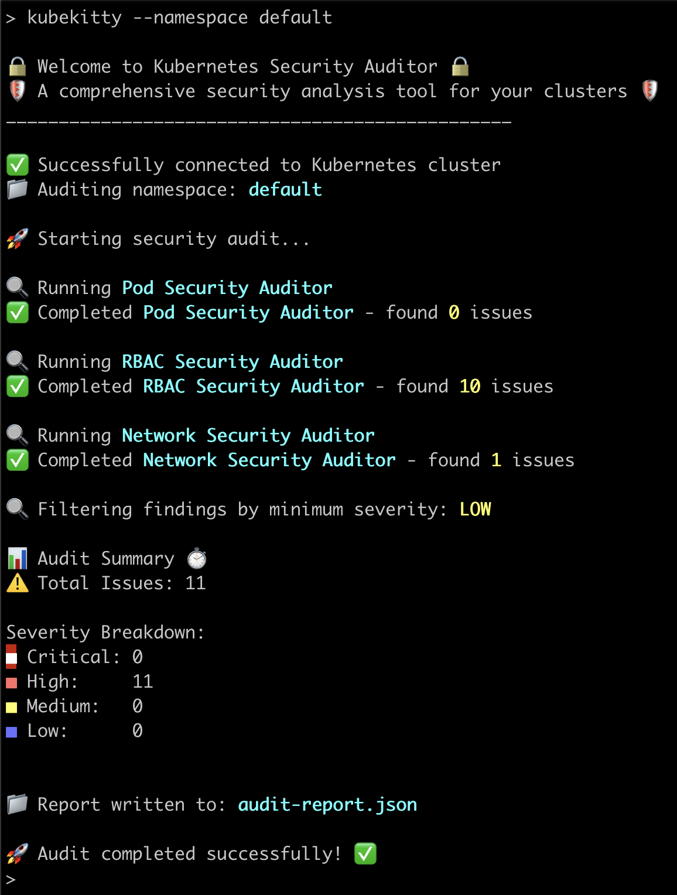

# KubeKitty 

A comprehensive security analysis tool for Kubernetes clusters.



## Installation

```bash
go get github.com/afshin-deriv/kubekitty
```

## Quick Start

```bash
kubekitty --namespace default
```

## Example YAML structure
```
rules:
  - name: No wildcard verbs in ClusterRoles
    description: ClusterRoles should not use wildcard verbs for permissions.
    category: RBAC
    severity: HIGH
    condition: verbs contains "*"
    suggestion: Specify explicit verbs instead of wildcards.
  - name: No hostPID in PodSecurityContext
    description: Pods should not share the host's PID namespace.
    category: PodSecurity
    severity: HIGH
    condition: .spec.hostPID == true
    suggestion: Set hostPID to false in the Pod's security context.
```
## Features

- 🔍 Comprehensive security auditing
- 🛡️ Multiple security checks
- 📊 Detailed reporting
- 🚀 Easy to use
